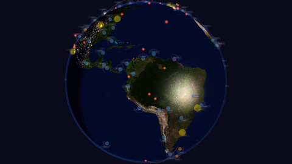
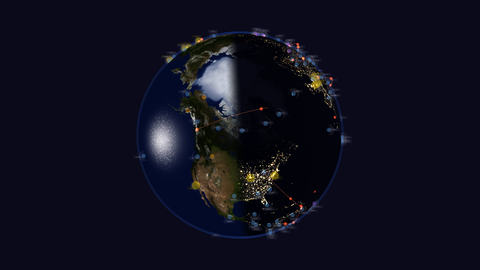

# Earth Flight Dashboard

A cinematic Three.js globe visualization showing real-time flight routes between major global hubs. Serves as a mesmerizing screensaver / demo of WebGL-powered geospatial data visualization.



## Features

- **Real-time great-circle flight arcs** animated between 80+ global airports
- **Cinematic tour mode** — automatically activates after user inactivity, smoothly orbiting the globe through key regions
- **Day/night terminator** — real-time sun position drives the terminator shader
- **Interactive controls** — drag to rotate, scroll to zoom, click airports for details
- **Glassmorphism UI** — frosted panels showing live flight statistics
- **Auto-reset** — simulation resets when total flights hit a configurable threshold (default: 100)

## Quick Start

Visit the live demo: https://frankhouston.github.io/Earth-Flight-Dashboard

Or run locally:

```bash
git clone https://github.com/frankhouston/Earth-Flight-Dashboard.git
cd Earth-Flight-Dashboard
npm install
npm run dev
```

## Screenshots

### Southern Hemisphere Tour: Antarctica → Cape Hope → Cape Horn → New Zealand → Sydney → Chicago → London → Spin


### Northern Hemisphere: North America → Arctic → Europe → Asia-Pacific → Pacific Crossing → Americas



## Cinematic Tour Waypoints

The auto-demo follows this sequence (activates after 10s of inactivity):

1. Wide Earth overview
2. North America
3. North pole
4. Europe/Africa
5. Asia-Pacific
6. Pacific crossing
7. Americas
8. **Antarctica — Rothera Station (RYG)**
9. **Cape of Good Hope**
10. **Cape Horn + Falklands**
11. **New Zealand**
12. **Sydney, Australia**
13. **Chicago (ORD)** — transition through North American hub
14. **London (LHR)** — European perspective
15. Low orbit
16. Wide overview
17. **Full 360° spinning globe**
18. Loop back

## Build

```bash
npm run build
```

Outputs static files to `dist/` — deploy with any static web server.

## Tech Stack

- Three.js r185
- TypeScript
- Vite 8.2
- GLSL shaders for day/night terminator

## License

MIT
